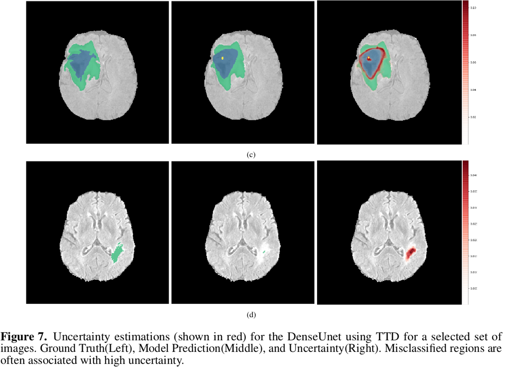

# BioExp
Explainaning Deep Learning Models which perform various image processing tasks in the medical domain.

# Citations
If you use BioExp, please cite our work:

```
@article{natekar2019demystifying,
  title={Demystifying Brain Tumour Segmentation Networks: Interpretability and Uncertainty Analysis},
  author={Natekar, Parth and Kori, Avinash and Krishnamurthi, Ganapathy},
  journal={arXiv preprint arXiv:1909.01498},
  year={2019}
}

```

# Defined Pipeline


# Features
- Model Dissection Analysis
- Model Ablation Analysis
- Model Uncertainty Analysis
  - epistemic
  - aleatoric
- GradCAM
- Activation Maximization

# Installation
Running of the explainability pipeline requires a GPU and several deep learning modules. 

### Requirements
- 'pandas'
- 'numpy'
- 'scipy==1.6.0'
- 'matplotlib'
- 'pillow'
- 'simpleITK'
- 'opencv-python'
- 'tensorflow-gpu==1.14'
- 'keras'
- 'keras-vis'
- 'lucid'

The following command will install only the dependencies listed above.

```
pip install BioExp
```

# Results

### Dissection Results


### GradCAM Results


### Activation Results


### Uncertainty Results



# Usage 

## Python API usage
The application also has an API which can be used within python to perform the segmentation. 
```
from BioExp.spatial import Ablation
from BioExp.spatial import Dissector
from BioExp.spatial import cam
from BioExp.helpers import radfeatures
from BioExp.uncertainty import uncertainty
from BioExp.concept.feature import Feature_Visualizer

# look examples for using individual functions
```

# Contact
- Avinash Kori (koriavinash1@gmail1.com)
- Parth Natekar (parth@smail.iitm.ac.in)
